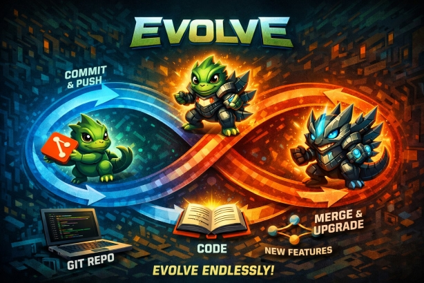

<p align="center">
  
</p>

# evolve

Self-improving evolution loop for any project, powered by Claude.

Point it at any git repo with a README → it reads the README as the specification,
iteratively fixes bugs and implements improvements, one at a time, until the project
fully converges to its spec.

## Installation

Install evolve as a Python package:

```bash
pip install .
```

Or with the optional rich TUI:

```bash
pip install ".[rich]"
```

For development:

```bash
pip install -e ".[rich,dev]"
```

After installation, the `evolve` command is available globally:

```bash
evolve start ~/projects/my-tool --check "pytest"
```

You can also run directly without installing:

```bash
python evolve.py start ~/projects/my-tool --check "pytest"
```

## Usage

```bash
# Initialize a config file for your project
evolve init <project-dir>

# Evolve a project (README = spec)
evolve start <project-dir> [--rounds 10] [--check "pytest"] [--timeout 300] [--model claude-opus-4-6] [--yolo] [--json] [--spec SPEC.md]

# Preview what the agent would do (read-only, no file changes)
evolve start <project-dir> --dry-run [--check "pytest"]

# Validate spec compliance without evolving (pass/fail per README claim)
evolve start <project-dir> --validate [--check "pytest"]

# Resume an interrupted session
evolve start <project-dir> --resume

# Autonomous forever mode (runs on a separate branch)
evolve start <project-dir> --forever [--check "pytest"]

# Check evolution status
evolve status <project-dir>

# Show evolution timeline across all sessions
evolve history <project-dir>

# Clean up old session directories
evolve clean <project-dir> [--keep 5]
```

## Examples

```bash
# Evolve a Python project, verify with pytest
evolve start ~/projects/my-tool --check "pytest" --rounds 20

# Evolve a Node project, verify with npm test
evolve start ~/projects/my-app --check "npm test"

# Evolve a Rust project
evolve start ~/projects/my-cli --check "cargo test"

# Evolve without a check command (opus runs commands manually)
evolve start ~/projects/my-lib

# Allow installing new packages
evolve start ~/projects/my-tool --check "pytest" --yolo

# Use a different model
evolve start ~/projects/my-tool --check "pytest" --model claude-sonnet-4-20250514

# Dry run — see what the agent would change without modifying files
evolve start ~/projects/my-tool --check "pytest" --dry-run

# Validate — check spec compliance without modifying files
evolve start ~/projects/my-tool --check "pytest" --validate

# Resume after interruption (continues from last completed round)
evolve start ~/projects/my-tool --check "pytest" --resume

# Autonomous forever mode — evolves indefinitely on a separate branch
evolve start ~/projects/my-tool --check "pytest" --forever

# JSON output for CI/CD pipelines
evolve start ~/projects/my-tool --check "pytest" --json

# Use a custom spec file instead of README.md
evolve start ~/projects/my-tool --check "pytest" --spec SPEC.md
evolve start ~/projects/my-tool --check "pytest" --spec docs/specification.md

# Initialize a config file with sensible defaults
evolve init ~/projects/my-tool

# Show evolution history across all sessions
evolve history ~/projects/my-tool

# Clean up old sessions, keeping the 5 most recent
evolve clean ~/projects/my-tool --keep 5
```

## Configuration

Evolve supports project-level configuration via `evolve.toml` or `pyproject.toml`.
This eliminates the need to repeat CLI flags on every run.

### Configuration file

Create an `evolve.toml` in your project root:

```toml
# evolve.toml
check = "pytest"
rounds = 20
timeout = 300
model = "claude-opus-4-6"
yolo = false
spec = "README.md"  # path to the spec file (default: README.md)

# Event hooks — shell commands executed on lifecycle events
[hooks]
on_round_end = "echo 'Round complete'"
on_converged = "curl -s -X POST https://hooks.slack.com/services/YOUR/WEBHOOK/URL -d '{\"text\": \"evolve converged!\"}'"
on_error = "notify-send 'evolve encountered an error'"
```

Or add an `[tool.evolve]` section to your existing `pyproject.toml`:

```toml
[tool.evolve]
check = "pytest"
rounds = 20
timeout = 300

[tool.evolve.hooks]
on_converged = "curl -s -X POST https://your-webhook-url"
```

### Resolution order

Settings are resolved in this order (first wins):

1. CLI flags (`--check "pytest"`)
2. Environment variables (`EVOLVE_MODEL`)
3. `evolve.toml` in project root
4. `pyproject.toml [tool.evolve]` section
5. Built-in defaults

### `evolve init`

Scaffold a config file with sensible defaults:

```bash
evolve init ~/projects/my-tool
# Creates ~/projects/my-tool/evolve.toml with default settings
```

## TUI

Evolve features a modern terminal UI powered by `rich`:

```
╭──────────────────── evolve ─────────────────────╮
│ EVOLUTION ROUND 3/10                            │
│ TARGET: [functional] Add input validation       │
│ PROGRESS: ██████░░░░ 5/9 improvements done      │
╰─────────────────────────────────────────────────╯

  [check] pytest ─────────────────────────────────
  ✓ 42 passed · 0 failed · 1.2s

  [agent] Claude opus working...
  [opus] Read → src/parser.py
  [opus] Edit → src/parser.py (edit)
  [opus] Bash → pytest tests/test_parser.py
  [opus] Edit → runs/improvements.md (edit)

  [verify] pytest ────────────────────────────────
  ✓ 43 passed · 0 failed · 1.3s

  [git] feat(parser): add input validation → pushed

  Progress: 6 done, 3 remaining
```

### Completion summary

When evolution finishes (converged or max rounds), evolve prints a summary panel
to the terminal:

```
╭──────────── Evolution Complete ─────────────╮
│ ✅ CONVERGED in 8 rounds (12m 34s)          │
│                                              │
│ 6 improvements completed                    │
│ 2 bugs fixed                                │
│ 47 tests passing                            │
│                                              │
│ Report: runs/20260325/evolution_report.md    │
╰──────────────────────────────────────────────╯
```

The summary is generated from the session's `evolution_report.md` and displayed
through the TUI (Rich panel, plain text, or JSON event depending on output mode).

### TUI features

- Colored panels for round headers with progress bars
- Real-time agent activity feed (tools used, files edited)
- Check command results with pass/fail indicators
- Git commit + push status
- Completion summary panel on exit
- Graceful fallback to plain text when `rich` is not installed
- TUI interface enforced via Protocol — RichTUI, PlainTUI, and JsonTUI all implement the same `TUIProtocol`, guaranteeing method parity at type-check time

### JSON output mode

For CI/CD integration, use `--json` to emit structured JSON events to stdout
instead of the interactive TUI:

```bash
evolve start ~/projects/my-tool --check "pytest" --json
```

Each line is a JSON object with a `type`, `timestamp`, and event-specific fields:

```json
{"type": "round_start", "timestamp": "2026-03-24T16:00:00Z", "round": 1, "max_rounds": 10}
{"type": "check_result", "timestamp": "2026-03-24T16:00:05Z", "label": "check", "cmd": "pytest", "passed": true}
{"type": "agent_tool", "timestamp": "2026-03-24T16:01:00Z", "tool": "Edit", "input": "src/parser.py"}
{"type": "improvement_completed", "timestamp": "2026-03-24T16:02:00Z", "description": "Add input validation"}
{"type": "converged", "timestamp": "2026-03-24T16:05:00Z", "round": 3, "reason": "All README claims verified"}
{"type": "hook_fired", "timestamp": "2026-03-24T16:05:01Z", "event": "on_converged", "success": true}
```

The `JsonTUI` class implements the same `TUIProtocol` as `RichTUI` and `PlainTUI`,
ensuring all output methods are available in JSON mode with zero changes to business logic.

## How it works

Each `evolve start` creates a timestamped session. Each round runs as a **monitored
subprocess** so code changes are picked up immediately and stalled processes are
automatically detected and killed.

```
<project>/
├── README.md                          # THE SPEC — evolve converges to this
├── evolve.toml                        # (optional) project-level config
├── runs/
│   ├── improvements.md                # shared — one improvement added per round
│   ├── memory.md                      # shared — cumulative error log, compacted each round
│   ├── 20260324_160000/               # session 1
│   │   ├── state.json                 # real-time session state (queryable)
│   │   ├── conversation_loop_1.md     # full opus conversation log
│   │   ├── conversation_loop_2.md
│   │   ├── check_round_1.txt          # post-fix check results
│   │   ├── subprocess_error_round_3.txt  # diagnostic from crashed/stalled round
│   │   ├── evolution_report.md        # post-session summary with timeline
│   │   ├── dry_run_report.md          # (dry-run only) read-only analysis
│   │   ├── validate_report.md         # (validate only) spec compliance report
│   │   ├── COMMIT_MSG                 # (transient) commit message from opus
│   │   └── CONVERGED                  # written by opus when done
│   └── 20260324_170000/               # session 2
│       ├── ...
│       ├── party_report.md            # multi-agent discussion log
│       └── README_proposal.md         # proposed next README
└── prompts/
    └── evolve-system.md               # (optional) project-specific prompt override
```

**Each round — one improvement at a time:**

```
1. Run check command (pytest, npm test, cargo test, etc.) → results
2. Opus receives: README + improvements.md + memory.md + check results
   + crash diagnostic from previous round (if any)
3. Opus reads run directory and memory.md for context
4. Phase 1 — ERRORS: fix any failures from check command (mandatory)
5. Phase 2 — SPEC FRESHNESS CHECK (gate): compare
   `mtime(README.md)` vs `mtime(improvements.md)`.
     - If the README is **newer** than `improvements.md`, the spec has
       changed since the backlog was last built and the existing items are
       considered stale. The agent sets the whole backlog aside (items are
       marked `[stale: spec changed]`) and rebuilds `improvements.md` from
       the README: one item per claim that is not yet implemented. The
       round's target becomes the first of those rebuilt items.
     - If `improvements.md` is newer or equal, skip to Phase 3 — the backlog
       is still aligned with the spec.
   This cheap mtime check is what guarantees README edits take priority over
   the improvement queue: touching `README.md` today means the next round
   first rebuilds the backlog from the updated spec, then works on the new
   gap — no full spec walk required every round.
6. Phase 3 — IMPROVEMENT: implement one item from `improvements.md`, verify,
   check it off. Then add exactly one new improvement (most impactful next
   issue).
7. Phase 4 — CONVERGENCE: only when `mtime(improvements.md) >= mtime(README.md)`
   AND `improvements.md` has no unchecked non-blocked items, write `CONVERGED`
8. Opus logs errors to memory.md, compacts it
9. Opus verifies every file it wrote by reading it back
10. Opus writes COMMIT_MSG with conventional commit message
11. Git commit + push
12. Fire event hooks (on_round_end)
13. Orchestrator re-runs check → saves check_round_N.txt
14. Write updated state.json
15. Next round starts as fresh subprocess (reloaded code)

--- watchdog & debug retry ---

If a subprocess crashes, stalls (no output for 120s), or makes no progress,
the orchestrator:
  a. Saves a diagnostic file (subprocess_error_round_N.txt)
  b. Fires on_error hook
  c. Retries the round (up to 2 debug retries per round)
  d. The retry receives the crash diagnostic in its prompt
  e. In --forever mode, exhausted retries skip to the next round

--- after convergence ---

13. Fire on_converged hook
14. Party mode: all agents brainstorm next evolution
15. Agents produce:
    - party_report.md — full discussion log with each agent's reasoning
    - README_proposal.md — proposed updated README
16. Operator reviews both files
17. If approved: replace README.md → new evolution loop
```

### Real-time state file

Each session maintains a `state.json` file updated after every round, providing
structured status queryable by external tools (CI systems, dashboards, monitoring):

```json
{
  "version": 1,
  "session": "20260325_153156",
  "project": "my-tool",
  "round": 5,
  "max_rounds": 20,
  "phase": "improvement",
  "status": "running",
  "improvements": {"done": 12, "remaining": 3, "blocked": 1},
  "last_check": {"passed": true, "tests": 143, "duration_s": 1.3},
  "started_at": "2026-03-25T15:31:56Z",
  "updated_at": "2026-03-25T16:05:00Z"
}
```

The `status` field can be: `running`, `converged`, `max_rounds`, `error`, or `party_mode`.
The schema is versioned for forward compatibility.

### Event hooks

Evolve fires lifecycle events that can trigger external commands. Configure hooks
in `evolve.toml`:

```toml
[hooks]
on_round_start = "echo 'Starting round'"
on_round_end = "echo 'Round complete'"
on_converged = "curl -s -X POST https://hooks.slack.com/services/T00/B00/xxx -d '{\"text\": \"Project converged!\"}'"
on_error = "notify-send 'evolve error'"
```

**Supported events:**

| Event | Fires when |
|-------|-----------|
| `on_round_start` | A new round begins |
| `on_round_end` | A round completes successfully |
| `on_converged` | The project reaches convergence |
| `on_error` | A round fails (crash, stall, or check failure) |

**Hook execution model:**
- Hooks run as fire-and-forget subprocesses with a 30-second timeout
- A failing hook never blocks the evolution loop — failures are logged and skipped
- Hook commands receive event context via environment variables (`EVOLVE_SESSION`,
  `EVOLVE_ROUND`, `EVOLVE_STATUS`)
- Hooks are managed by the `hooks.py` module, keeping orchestration logic clean

### Evolution report

After each session completes (converged or max rounds reached), evolve writes
`runs/<session>/evolution_report.md` — a summary of what happened:

```markdown
# Evolution Report
**Project:** my-tool
**Session:** 20260324_160000
**Rounds:** 8/20
**Status:** CONVERGED

## Timeline
| Round | Action | Files Changed | Tests |
|-------|--------|---------------|-------|
| 1 | fix: parser crash on empty input | parser.py | 42→43 |
| 2 | feat: add input validation | validator.py, parser.py | 43→47 |
...

## Summary
- 6 improvements completed
- 2 bugs fixed
- 12 files modified
```

The report is generated by parsing conversation logs, commit messages, and check
results from the session directory. It serves both human review (post-session summary)
and CI/CD integration (PR description content).

### Subprocess monitoring & debug retries

Every round runs as a monitored subprocess. The orchestrator streams stdout in
real-time via a reader thread and enforces a **watchdog timer** — if the
subprocess produces no output for 120 seconds, it is considered stalled and
killed.

When a round fails (crash, stall, or zero progress), the orchestrator enters a
**debug retry loop**:

1. Writes `subprocess_error_round_N.txt` with full diagnostic (exit code,
   last 3000 chars of output, reason for failure)
2. Fires `on_error` hook
3. Retries the round — the agent receives the diagnostic in its prompt under a
   "CRITICAL — Previous round CRASHED" header and fixes the root cause
4. Up to 2 debug retries per round (3 total attempts)
5. In `--forever` mode, exhausted retries skip to the next round instead of
   exiting

The agent is aware of the watchdog via the system prompt and is instructed to:
- Print progress lines as it works (silence = kill)
- Add logging/probes in delivered code for runtime observability
- Print a status line before long-running commands

**"Zero progress" detection.** A round is counted as no-progress (and therefore
triggers the debug retry loop) when **any** of the following holds:

- The subprocess exits non-zero (crash)
- The watchdog fires (120s silence)
- The check command regressed (was passing, now failing)
- The agent committed **without** writing a `COMMIT_MSG` file — the orchestrator
  falls back to `chore(evolve): round N`, which is the tell-tale sign the agent
  ran out of turn budget before finishing its work
- **No improvement was checked off and no new improvement was added** to
  `improvements.md` — the round ended with `improvements.md` byte-identical to
  its pre-round state

The last two conditions matter because they catch the failure mode where the
agent spends its entire turn budget on reconnaissance (Reads, Greps) and is
killed before writing any Edit/Write. The subprocess exits 0, the check still
passes (nothing changed), but no real work happened — previously this would
silently burn rounds until `max_rounds`. The debug retry now kicks in, and the
agent receives a "CRITICAL — Previous round made NO PROGRESS" header
instructing it to start with Edit/Write immediately and defer exploration.

**No per-turn cap.** The Claude Agent SDK's `max_turns` parameter is **not set**
when invoking the agent, so a round can run as many tool calls as it needs to
finish the improvement. The watchdog (stall detection on 120s of silence) and
the round-level timeout are the only bounds on agent runtime — an explicit
`max_turns` was removed after it caused rounds to be killed mid-work on large
targets, producing the silent no-progress loops described above. If a target is
so big that a round runs for hours, that is a signal to split the improvement,
not to re-introduce a turn cap.

**Agent-side self-monitoring.** On top of the orchestrator's zero-progress
detection, the agent itself inspects the last two rounds' conversation logs
(`conversation_loop_{N-1}.md` and `conversation_loop_{N-2}.md`) at the start of
every round and refuses to repeat a stuck pattern. Specifically, before doing
any work the agent:

1. Reads the previous two conversation logs from the current run directory
2. Extracts the improvement target each round was attempting
3. Flags a **stuck loop** if the current target matches either of them and the
   prior round(s) contain no `Edit`/`Write` tool calls — i.e. pure
   reconnaissance followed by a placeholder commit
4. When stuck is detected, the agent does **not** resume the original target.
   Instead, it:
   - Splits the target in `improvements.md` into smaller independent items
     (one per file, per uncovered line range, per behavior), or
   - Marks the target as blocked with `[blocked: target too broad — split required]`
     and picks a different unchecked item
5. Logs the decision to `memory.md` so future rounds don't re-attempt the same
   broken split

This makes the agent self-healing for the most common failure mode — getting
lost in a target that's too large — without operator intervention. The
orchestrator's zero-progress retry remains the safety net; agent-side detection
is the first line of defense and catches the loop one round earlier.

### The --check flag

The `--check` flag specifies how to verify the project works. Any shell command:

```bash
--check "pytest"                    # Python
--check "npm test"                  # Node
--check "cargo test"                # Rust
--check "go test ./..."             # Go
--check "make test && make lint"    # Multiple checks
```

If omitted, evolve auto-detects the test framework by looking for common tools
(`pytest`, `npm test`, `cargo test`, `go test`, `make test`, etc.) and uses the
first one found. With an explicit `--check`, the orchestrator uses that command
instead. In both cases, the check is run automatically before and after each round
for objective verification.

### The --timeout flag

Sets the maximum time (in seconds) the check command is allowed to run before being
killed. Defaults to 300 seconds (5 minutes). Increase for slow test suites:

```bash
--timeout 600    # 10 minutes
```

### The --model flag

Sets the Claude model to use for evolution. Defaults to `claude-opus-4-6`.
Can also be set via the `EVOLVE_MODEL` environment variable (CLI flag takes precedence).

```bash
--model claude-opus-4-6             # Default — most capable
--model claude-sonnet-4-20250514    # Faster, lower cost
```

```bash
# Or via environment variable
export EVOLVE_MODEL=claude-sonnet-4-20250514
evolve start ~/projects/my-tool --check "pytest"
```

### The --spec flag

By default, evolve treats `README.md` as the project specification. Use `--spec` to
point at a different file if your project uses a different convention (e.g. `SPEC.md`,
`docs/specification.md`, `CLAIMS.md`).

```bash
# Use a custom spec filename at the project root
evolve start ~/projects/my-tool --check "pytest" --spec SPEC.md

# Use a spec file nested in a subdirectory
evolve start ~/projects/my-tool --check "pytest" --spec docs/specification.md
```

The path is resolved relative to the project directory. The chosen file takes the
exact role that `README.md` normally plays:

- It is the source of truth the agent converges to
- Every claim in it is verified during `--validate`
- In `--forever` mode, party mode produces a `<spec>_proposal.md` next to it and
  replaces it at the start of the next cycle

Can also be set via `evolve.toml`:

```toml
spec = "SPEC.md"
```

Or via the `EVOLVE_SPEC` environment variable. Resolution order is the same as
every other setting (CLI → env → `evolve.toml` → `pyproject.toml` → default).

If the specified file does not exist, evolve exits with code 2 and a clear error
message — it does not fall back to `README.md`.

### The --dry-run flag

Runs the agent in **read-only analysis mode** — it examines the project and produces
a report of what it *would* change, without actually modifying any files.

```bash
evolve start ~/projects/my-tool --check "pytest" --dry-run
```

**How it works:**

1. Runs the check command (if provided) to see current state
2. Launches the agent with write-related tools disabled (no Edit, Write, or Bash)
3. Agent analyzes the README, code, and check results using only Read, Grep, and Glob
4. Produces `runs/<session>/dry_run_report.md` with:
   - Identified gaps between README spec and implementation
   - Proposed improvements (what would be added to `improvements.md`)
   - Estimated number of rounds to convergence
5. No files are modified, no git commits are created

Useful for:
- Previewing evolution scope before committing to a full run
- Auditing what the agent considers "missing" from the spec
- Estimating effort for a new project
- CI/CD gates that check spec compliance without modifying code

### The --validate flag

Runs a **spec compliance check** — verifies every claim in the README against the
actual codebase and reports pass/fail for each one. Similar to `--dry-run` but
focused specifically on validation rather than improvement planning.

```bash
evolve start ~/projects/my-tool --check "pytest" --validate
```

**How it works:**

1. Runs the check command (if provided) to verify current test state
2. Launches the agent in read-only mode with a validation-focused prompt
3. Agent systematically checks every README claim against the code
4. Produces `runs/<session>/validate_report.md` with:
   - Each README claim listed with ✅ (implemented) or ❌ (missing/broken)
   - Overall compliance percentage
   - Specific gaps identified with file references
5. No files are modified, no git commits are created

**Exit codes for --validate:**

| Exit Code | Meaning |
|-----------|---------|
| 0 | All README claims validated — spec compliant |
| 1 | One or more claims failed validation |
| 2 | Error during validation |

Useful for:
- CI quality gates ("does the code match the spec?")
- Pre-merge checks on PRs that modify the README
- Auditing spec compliance on a schedule
- Replacing manual code review for spec adherence

### The --resume flag

Resumes the most recent interrupted session instead of creating a new one. Detects the
last completed round from existing conversation logs and continues from the next round.

```bash
# Session interrupted at round 5 — resume from round 6
evolve start ~/projects/my-tool --check "pytest" --resume
```

If no previous session exists, `--resume` starts a fresh session (same as without the flag).

### The --forever flag

Autonomous evolution mode. Runs indefinitely on a **separate git branch** until the
operator stops it (Ctrl+C or kill).

```bash
evolve start ~/projects/my-tool --check "pytest" --forever
```

**How it works:**

1. Creates a new branch `evolve/<timestamp>` from the current branch
2. Runs the normal evolution loop (Phase 1-3) until convergence
3. After convergence, launches party mode — agents brainstorm the next evolution
4. **Instead of waiting for operator approval**, automatically merges the
   `README_proposal.md` into `README.md`
5. Resets `improvements.md` and starts a new evolution loop against the updated README
6. Repeats until stopped by the operator

```
main ──────────────────────────────────────────────────
       \
        evolve/20260324_220000 ─── round 1 ─── round 2 ─── CONVERGED
                                                                │
                                                          party mode
                                                                │
                                                     README_proposal → README.md
                                                                │
                                                          round 1 ─── round 2 ─── CONVERGED
                                                                                       │
                                                                                 party mode
                                                                                       │
                                                                                     ...
```

All work happens on the `evolve/*` branch — `main` is never touched. The operator can:
- Watch progress in real-time via the TUI
- Review the branch at any time (`git log evolve/<timestamp>`)
- Merge when satisfied (`git merge evolve/<timestamp>`)
- Or discard the branch entirely (`git branch -D evolve/<timestamp>`)

Combines well with `--yolo` for fully autonomous evolution:

```bash
# Full autonomy — installs packages, updates README, loops forever
evolve start ~/projects/my-tool --check "pytest" --forever --yolo
```

### The --json flag

Switches output from the interactive TUI to structured JSON events on stdout.
Each line is a valid JSON object. Designed for CI/CD pipelines, monitoring dashboards,
and programmatic consumption.

```bash
evolve start ~/projects/my-tool --check "pytest" --json
```

### `evolve history`

Show the evolution timeline across all sessions for a project:

```bash
evolve history ~/projects/my-tool
```

Output:

```
  Evolution History: ~/projects/my-tool
  ──────────────────────────────────────

  Session              Rounds   Status      Improvements
  20260324_160000      8/20     CONVERGED   6 done, 0 remaining
  20260324_170000      3/10     CONVERGED   3 done, 0 remaining
  20260325_072223      1/10     CONVERGED   28 done, 0 remaining

  Total: 3 sessions, 12 rounds, 37 improvements
```

Shows each session's round count, convergence status, and improvement statistics.
Parses `evolution_report.md` and `CONVERGED` markers from each session directory.

### improvements.md — the convergence tracker

One improvement added per round:
- A checkbox (`[ ]` pending, `[x]` done)
- A type tag: `[functional]` or `[performance]`
- Optional `[needs-package]` flag — skipped unless `--yolo`

### memory.md — cumulative error log

Each agent reads it to avoid repeating mistakes. Each agent compacts it at end of turn.

### Convergence

Opus decides convergence, but only after **two independent gates** both pass in
the same round:

1. **Spec freshness gate** (Phase 2 above) —
   `mtime(improvements.md) >= mtime(README.md)`. If the README was touched
   more recently than the backlog, the backlog is stale and must be rebuilt
   before anything else happens.
2. **Improvement backlog gate** — `improvements.md` has zero unchecked
   non-blocked items.

The spec gate always runs first, on every round, *before* any improvement
work. This guarantees README edits made mid-run take priority: touching
`README.md` today means the next round rebuilds `improvements.md` from the
updated spec, pushing the stale backlog aside until the new claims are
implemented. A single `stat` call is all it takes — no full spec walk on
rounds where the README hasn't moved.

When both gates pass, Opus writes `CONVERGED` with justification.

### Phase 5 — Party mode (post-convergence)

After convergence, all agents from `agents/` brainstorm the next evolution:

**Inputs:**
- Agent personas from `agents/*.md`
- Workflow from `workflows/party-mode/`
- Current README, improvements history, memory

**Outputs:**
- `party_report.md` — full discussion explaining each agent's reasoning
- `README_proposal.md` — complete updated README for the next cycle

The operator reviews both files and decides whether to accept the proposal.

### Git convention

Every commit follows conventional commits:

```
<type>(<scope>): <short description>

<body>
```

Types: `fix`, `feat`, `refactor`, `perf`, `docs`, `test`, `chore`

### --yolo mode

By default, improvements requiring new packages are blocked. Use `--yolo` to allow.

### Project-specific prompts

Projects can override the default system prompt by creating `prompts/evolve-system.md`
in their project directory. Evolve will use it instead of the default.

### `evolve clean`

Remove old session directories to free disk space:

```bash
# Keep the 5 most recent sessions, delete the rest
evolve clean ~/projects/my-tool --keep 5

# Keep only the latest session
evolve clean ~/projects/my-tool --keep 1
```

Sessions are sorted by timestamp. The `--keep` flag specifies how many recent
sessions to retain (default: 5). Committed code changes are preserved in git
history regardless of session cleanup.

### Exit codes

`evolve start` returns meaningful exit codes for CI/CD integration:

| Exit Code | Meaning |
|-----------|---------|
| 0 | Converged — project fully matches README spec |
| 1 | Max rounds reached — improvements remain |
| 2 | Error — agent failure, missing deps, or invalid args |

```bash
# Use in CI
evolve start . --check "pytest" --rounds 20
if [ $? -eq 0 ]; then echo "Converged!"; fi
```

```bash
# Full CI/CD example with JSON output
evolve start . --check "pytest" --rounds 20 --json > evolve-output.jsonl
EXIT_CODE=$?
if [ $EXIT_CODE -eq 0 ]; then
  echo "Converged! Creating PR..."
  # Parse evolve-output.jsonl for PR description
fi
```

## CI/CD Integration

### GitHub Actions

Evolve works in CI/CD pipelines out of the box. Here's a GitHub Actions workflow
that evolves a project and creates a PR with the results:

```yaml
name: Evolve
on:
  workflow_dispatch:
  schedule:
    - cron: '0 2 * * 1'  # Weekly on Monday at 2am

jobs:
  evolve:
    runs-on: ubuntu-latest
    steps:
      - uses: actions/checkout@v4

      - uses: actions/setup-python@v5
        with:
          python-version: '3.12'

      - name: Install evolve
        run: pip install .

      - name: Run evolution
        env:
          ANTHROPIC_API_KEY: ${{ secrets.ANTHROPIC_API_KEY }}
        run: |
          evolve start . --check "pytest" --rounds 20 --json > evolve-output.jsonl
          echo "EXIT_CODE=$?" >> $GITHUB_ENV

      - name: Create PR on convergence
        if: env.EXIT_CODE == '0'
        uses: peter-evans/create-pull-request@v6
        with:
          title: 'feat: evolve convergence'
          body: |
            Automated evolution run converged.
            See `runs/*/evolution_report.md` for details.
          branch: evolve/ci-run
```

### Validation in CI

Use `--validate` as a quality gate in pull request checks:

```yaml
name: Spec Compliance
on: [pull_request]

jobs:
  validate:
    runs-on: ubuntu-latest
    steps:
      - uses: actions/checkout@v4
      - run: pip install .
      - name: Validate spec compliance
        env:
          ANTHROPIC_API_KEY: ${{ secrets.ANTHROPIC_API_KEY }}
        run: evolve start . --validate --check "pytest"
```

## Writing specs for evolve

Evolve treats your README as the specification. The quality of your README directly
affects how well evolve can converge your project. Here are guidelines for writing
effective specs:

### Be specific and verifiable

```markdown
# Good — evolve can verify this
"The CLI returns exit code 0 on success and exit code 1 on failure."
"Tests target 80% coverage minimum."

# Vague — evolve can't objectively verify this
"The CLI has good error handling."
"The code is well-tested."
```

### Include command examples

Evolve can literally run examples from your README to verify they work:

```markdown
# Good — testable commands
$ my-tool parse input.json --format csv
$ my-tool validate schema.json

# Vague — not testable
"my-tool supports various input formats"
```

### Describe the architecture

Architectural descriptions help the agent make consistent design decisions:

```markdown
# Good — clear structure
| Module | Responsibility |
|--------|---------------|
| cli.py | Argument parsing, entry point |
| core.py | Business logic |
| io.py | File I/O, serialization |
```

### State test expectations

Explicit test targets give the agent a clear convergence criterion:

```markdown
# Good — measurable
"The project targets 80% test coverage minimum."
"All public functions have type annotations and docstrings."
```

### Keep it current

The README should describe what the project *should* be, not what it was. Update
it when requirements change — evolve will converge to the new spec.

## Architecture

Evolve is organized into five modules with clear responsibilities:

| Module | Responsibility |
|--------|---------------|
| `evolve.py` | CLI entry point, argument parsing, config resolution |
| `loop.py` | Evolution orchestrator — monitored subprocesses, watchdog, debug retries, party mode |
| `agent.py` | Claude SDK interface — prompt building, agent execution, retry logic |
| `tui.py` | Terminal UI — `TUIProtocol` with Rich, Plain, and JSON implementations |
| `hooks.py` | Event hooks — loading config, matching events, fire-and-forget execution |

### Config resolution

Settings are resolved via a data-driven loop over field definitions, with each
field checking CLI → environment variable → config file → default in order.
This eliminates per-field duplication and makes adding new settings trivial.

### Retry and error handling

**Agent-level retries** — `analyze_and_fix` and `_run_party_mode` share the same
retry helpers for:
- Benign async teardown errors (cancel scope, event loop closed)
- Rate limit detection with exponential backoff
- Configurable max retries

**Orchestrator-level retries** — `_run_rounds` monitors each subprocess with a
watchdog timer and retries failed rounds:
- `_run_monitored_subprocess` uses `Popen` + reader thread for real-time output
  streaming and stall detection (120s silence threshold)
- `_save_subprocess_diagnostic` writes crash/stall context to disk
- Debug retry loop re-runs the round with the diagnostic injected into the
  agent's prompt, up to 2 retries per round

### Hook execution

The `hooks.py` module manages event hook lifecycle:
- Loads hook configuration from `evolve.toml` or `pyproject.toml`
- Matches lifecycle events to configured shell commands
- Executes hooks as fire-and-forget subprocesses with 30-second timeout
- Sets environment variables for hook context (`EVOLVE_SESSION`, `EVOLVE_ROUND`, `EVOLVE_STATUS`)
- Logs failures without blocking the evolution loop
- Fully testable in isolation from the orchestrator

## Development

Evolve has its own test suite. Run it with pytest:

```bash
# Run all tests
pytest tests/

# Run with coverage
pytest tests/ --cov=. --cov-report=term-missing
```

### Test coverage target

The project targets **80% test coverage** minimum. Current coverage should be
verified before merging any changes:

```bash
pytest tests/ --cov=. --cov-report=term-missing --cov-fail-under=80
```

### Test structure

```
tests/
├── test_loop.py            # _is_needs_package, counters, _get_current_improvement, _detect_last_round, _count_blocked
├── test_loop_extended.py   # _git_commit, _run_monitored_subprocess, _save_subprocess_diagnostic, resume, reports
├── test_agent.py           # build_prompt, error helpers, retry logic
├── test_tui.py             # factory function, TUI Protocol parity, JsonTUI
├── test_evolve.py          # CLI arg parsing, _show_status, config resolution, init, clean, history
└── test_hooks.py           # hook loading, event matching, execution, timeout, failure handling
```

Tests cover all pure utility functions without requiring the Claude SDK. Integration
tests that need the SDK use mocked responses. Error-path tests verify graceful
degradation under failure conditions (corrupted files, timeouts, missing dependencies).

## Requirements

- Python 3.10+
- `claude-agent-sdk`: `pip install claude-agent-sdk`
- `rich` (optional): `pip install rich` — for the modern TUI (fallback to plain text without it)
- Git repository
- Claude Code CLI installed and authenticated

### Model compatibility

Evolve works with any Claude model supported by the Agent SDK. Recommended:

| Model | Best for |
|-------|----------|
| `claude-opus-4-6` (default) | Maximum capability, complex projects |
| `claude-sonnet-4-20250514` | Faster iterations, simpler projects |

## Future directions

These are under consideration for future evolution cycles:

- **Multi-repo evolution** — evolve multiple related projects in coordination
- **Spec drift detection** — detect when code drifts from README over time and auto-fix
- **Parallel analysis** — run read-only analysis in parallel before sequential implementation
- **GitHub App / hosted service** — managed evolution service for teams

<!-- checked-by-anatoly -->
[](https://github.com/r-via/anatoly)
<!-- /checked-by-anatoly -->
